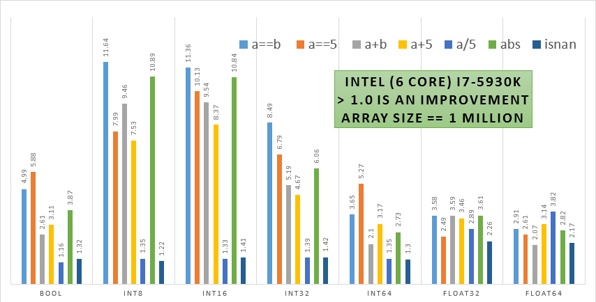
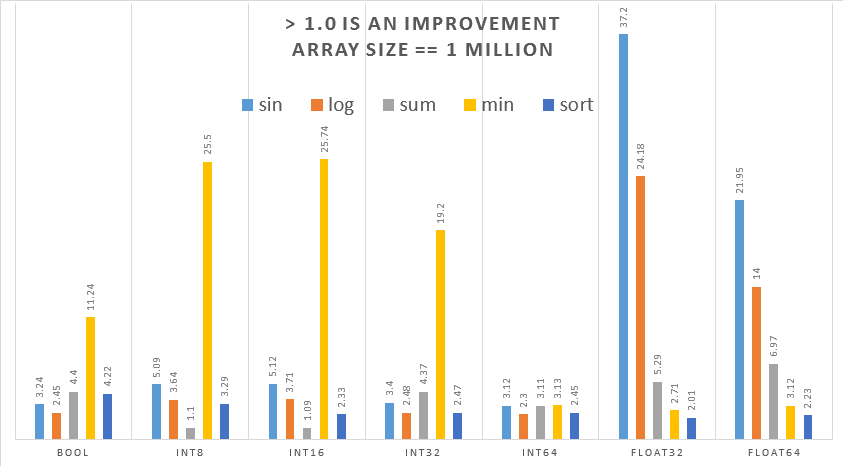
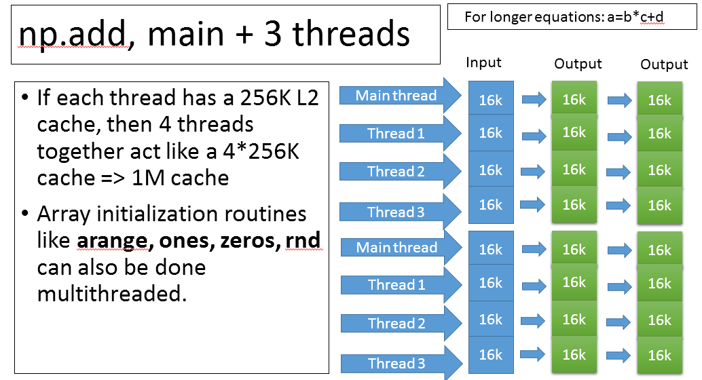

# PNumPy
Parallel NumPy seamlessly speeds up NumPy for large arrays (64K+ elements) with *no change required to your existing NumPy code*.

This first release speeds up NumPy binary and unary ufuncs such as **add, multiply, isnan, abs, sin, log, sum, min and many more**.
Sped up functions also include: **sort, argsort, lexsort, boolean indexing, and fancy indexing**.
In the near future we will speed up: **astype, where, putmask, arange, searchsorted**.

[](https://github.com/Quansight/numpy-threading-extensions/actions)

[](https://opensource.org/licenses/MIT)

## Installation
```
pip install pnumpy
```

You can also install the latest development versions with
```
pip install https://github.com/Quansight/numpy-threading-extensions/archive/main.zip
```

## Documentation

See the [full documentation](https://quansight.github.io/numpy-threading-extensions/stable/index.html)

To use the project:

```python
import pnumpy as pn
```

Parallel NumPy speeds up NumPy silently under the hood.  To see some benchmarks yourself run
```
pn.benchmark()
```



To get a partial list of functions sped up run
```
pn.atop_info()
```

To disable or enable pnumpy run
```
pn.disable()
pn.enable()
```

To cap the number of additional worker threads to 3 run
```
pn.thread_setworkers(3)
```
## Additional Functionality
PNumPy provides additional routines such as converting a NumPy record array to a column major array in parallel (**pn.recarray_to_colmajor**) which is useful for DataFrames.  Other routines include **pn.lexsort32**, which performs an indirect sort using **np.int32** instead of **np.int64** consuming half the memory and running faster.

## Threading
PNumPy uses a combination of threads and 256 bit vector intrinsics to speed up calculations.  By default most operations will only use 3 additional worker threads in combination with the main python thread for a total 4.  Large arrays are divided up into 16K chunks and threads are assigned to maintain cache coherency.  More threads are dynamically deployed for more intensive CPU problems like **np.sin**.  Users can customize threading.  The example below shows how 4 threads can work together to quadruple the effective L2 cache size.



## FAQ
**Q: If I type np.sort(a) where a is an array, will it be sped up?**

*A: If len(a) > 65536 and pnumpy has been imported, it will automatically be sped up*

**Q: How is sort sped up?**

*A: PNumPy uses additional threads to divide up the sorting job.  For example it might perform an 8 way quicksort followed by a 4 way mergesort*

## Development

To run all the tests run:

```
python -m pip install pytest
python -m pytest tests
```
